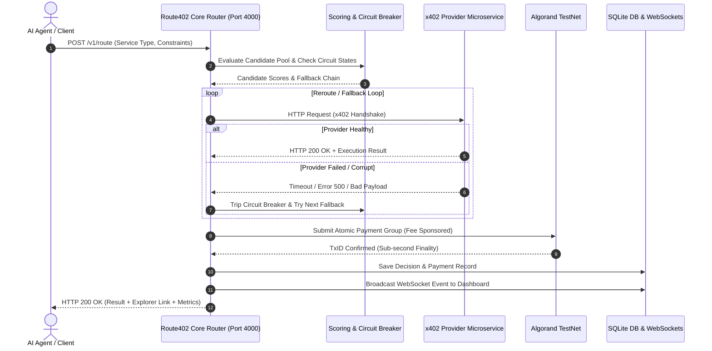

# 🚀 Route402 — x402-Native AI Agent Payment Router

<div align="center">


<p align="center">
  <b>Stateless HTTP 402 service routing, real-time candidate scoring, automated circuit-breaker fault tolerance, and atomic Algorand blockchain settlement for autonomous AI agents.</b>
</p>

</div>

---

## 📌 Overview

**Route402** is an x402-native routing and settlement layer built for autonomous AI agents. As AI agents increasingly consume paid third-party microservices (LLM inference, speech-to-text, vision, embeddings, data enrichment) at high frequency, forcing humans to manage credit cards and API keys creates structural bottlenecks.

With the **x402 `Payment Required` HTTP standard**, payments become a native property of HTTP requests. **Route402** eliminates provider lock-in by acting as an intelligent real-time gateway:
1. Receives a service request from an AI agent.
2. Evaluates registered microservice providers on price ($\mu\text{USDC}$), latency ($ms$), and SLA reliability.
3. Automatically routes traffic around failed or degraded nodes using an integrated **Circuit Breaker**.
4. Constructs and executes **Atomic Transaction Groups on Algorand**, incorporating fee abstraction so calling agents require zero ALGO balances.
5. Emits real-time telemetry over WebSockets and logs settlement records to a persistent SQLite database.

> *"AI agents can now pay for services on their own. Nobody's telling them which one to pick. Route402 does."*

---

## ⚡ Key Features

- 🧠 **Dynamic Multi-Factor Scoring Engine**
  Evaluates providers in real-time based on normalized price, latency, and reliability weighted parameters.
- ⛓️ **Algorand Atomic Group Settlement**
  Bundles micro-payments and service calls into zero-risk Algorand Atomic Transactions (`algosdk`), guaranteed by sub-second block finality.
- ⛽ **Fee Abstraction & Gas Sponsoring**
  The router sponsors transaction fees so autonomous agents do not need to hold or manage ALGO native tokens.
- 🛡️ **Automated Circuit Breaker Fault Isolation**
  Tracks failure thresholds and response times per provider. Automatically trips (`CLOSED` ➔ `OPEN` ➔ `HALF-OPEN`) to reroute traffic to healthy fallback candidates within milliseconds.
- 🧪 **Chaos Control & Failure Simulation**
  Interactive simulator built into the dashboard allowing live testing of provider outages (`offline`), artificial latency (`slow`), and corrupted payloads (`corrupt`).
- 🔗 **Pera Wallet Integration**
  Seamless connection with **Pera Wallet** on Algorand TestNet for balance verification and interactive wallet signing.
- 📊 **Real-Time Visual Dashboard & WebSockets**
  Monitors active providers, live candidate evaluation matrices, routing topologies, historical decision logs, and cumulative cost savings against naive single-provider baselines.
- 🧩 **Composite Task Pipeline Router**
  Supports multi-step agent workflows (e.g. `STT ➔ LLM ➔ Vector Search`) executed across distinct providers in a unified atomic settlement context.

---

## 🏗️ System Architecture



---

## 🛠️ Technology Stack

| Layer | Technology |
|---|---|
| **Frontend UI** | React 19, TypeScript, Vite 6, Tailwind CSS v4, Lucide Icons, Motion, Recharts |
| **Wallet** | Pera Wallet Connect (`@perawallet/connect`) |
| **Backend Router** | Node.js, Express, TypeScript, `tsx`, WebSockets (`ws`) |
| **Database** | SQLite via `better-sqlite3` |
| **Blockchain & x402** | Algorand TestNet, `algosdk`, `@algorandfoundation/algokit-utils` |

---

## 📁 Repository Structure

```
ROUTE402/
├── PRD.md                         # Detailed Product Requirements Document
├── README.md                      # Project documentation
├── index.html                     # Application entry HTML
├── package.json                   # Project dependencies and script runner
├── route402.db                    # SQLite database for decision and settlement logs
├── src/
│   ├── App.tsx                    # Main Dashboard Layout & Route State Router
│   ├── index.css                  # Design Tokens and Styling
│   ├── components/
│   │   ├── ChaosSimulator.tsx     # Live Fault Injection Controls
│   │   ├── CompositeTaskModal.tsx # Multi-step Pipeline Execution Dialog
│   │   ├── DecisionFeed.tsx       # Real-time WebSocket Decision Feed
│   │   ├── HeroMetrics.tsx        # High-level Economic Savings Metrics
│   │   ├── Navbar.tsx             # Main Header & Wallet Status
│   │   ├── PeraWalletModal.tsx    # Pera Wallet Connection & QR Modal
│   │   ├── ProviderCard.tsx       # Live Provider Health & Metrics Card
│   │   ├── RoutingVisualization.tsx # Interactive Graph of Candidate Scoring
│   │   ├── SettlementLedgerTable.tsx # On-chain Transaction Ledger
│   │   ├── Sidebar.tsx            # Navigation Sidebar
│   │   └── Views/
│   │       ├── AnalyticsView.tsx  # Savings & Performance Charts
│   │       ├── DashboardView.tsx  # Main Overview Dashboard
│   │       ├── ProvidersView.tsx  # Provider Pool Management
│   │       ├── RouterView.tsx     # Interactive Single & Composite Request Runner
│   │       ├── SettingsView.tsx   # Algorand Node & Router Configuration
│   │       └── TransactionsView.tsx # Settlement Ledger View
│   ├── data/
│   │   └── initialData.ts         # Initial Provider Configurations & Seed Data
│   ├── lib/
│   │   ├── peraWallet.ts          # Pera Wallet Client Singleton
│   │   └── routingEngine.ts       # Client-side Scoring & Evaluation Helper
│   ├── server/
│   │   ├── algorand.ts            # Algorand Atomic Group Builder & Signer
│   │   ├── circuitBreaker.ts      # Circuit Breaker Manager & Failure Tracker
│   │   ├── db.ts                  # SQLite Persistence & Schema Management
│   │   ├── index.ts               # Express Router Engine & WebSocket Server (Port 4000)
│   │   ├── providersServer.ts     # Mock x402 Provider Services (Ports 4001, 4002, 4003)
│   │   └── routingEngine.ts       # Multi-factor Candidate Scoring Algorithm
│   └── types.ts                   # Unified TypeScript Interfaces & Types
└── vite.config.ts                 # Vite Configuration
```

---

## 🚀 Getting Started

### Prerequisites

- **Node.js**: v18.0.0 or higher
- **npm** (v9+) or **bun**

### Installation

1. **Clone the repository:**
   ```bash
   git clone https://github.com/Yogesh-101/Route402.git
   cd Route402
   ```

2. **Install dependencies:**
   ```bash
   npm install
   ```

3. **Configure Environment Variables:**
   Create a `.env` file in the root directory (refer to `.env.example`):
   ```env
   PORT=4000
   VITE_API_BASE_URL=http://localhost:4000
   ALGORAND_NODE_URL=https://testnet-api.algonode.cloud
   ALGORAND_INDEXER_URL=https://testnet-idx.algonode.cloud
   ```

---

## 🏃 Running the Application

To run the complete application (Express Backend Router + 3 Mock x402 Microservices + Vite Frontend Dashboard):

```bash
npm run dev
```

- **Frontend Dashboard:** [http://localhost:3000](http://localhost:3000)
- **Backend API Router:** [http://localhost:4000](http://localhost:4000)
- **x402 Microservices:** Ports `4001` (Whisper), `4002` (DeepSeek-V3), `4003` (Llama-3-70B)
- **WebSocket Feed:** `ws://localhost:4000/v1/events`

---

## 📡 REST API Reference

### 1. Execute Single Route Request
`POST /v1/route`

**Request Body:**
```json
{
  "serviceType": "llm",
  "maxBudgetMicroUSDC": 5000,
  "maxLatencyMs": 2000,
  "prompt": "Analyze market trends for Algorand ecosystem"
}
```

### 2. Execute Composite Pipeline Route
`POST /v1/route/composite`

**Request Body:**
```json
{
  "steps": [
    { "serviceType": "stt" },
    { "serviceType": "llm" }
  ]
}
```

### 3. List Provider Pool & Circuit Status
`GET /v1/providers`

### 4. Fetch Decision Logs
`GET /v1/decisions`

### 5. Fetch Settlement Ledger
`GET /v1/payments`

### 6. Get Economic Savings Snapshot
`GET /v1/stats`

---

## 🧪 Verification & Build

To check TypeScript compilation:
```bash
npm run lint
```

To build for production:
```bash
npm run build
```

---

## 📄 License

This project was built for the **NexVerse — Algo + AI Hackathon** (Track 2 — Composite Entry / Agent Payment Router).

Distributed under the MIT License.
